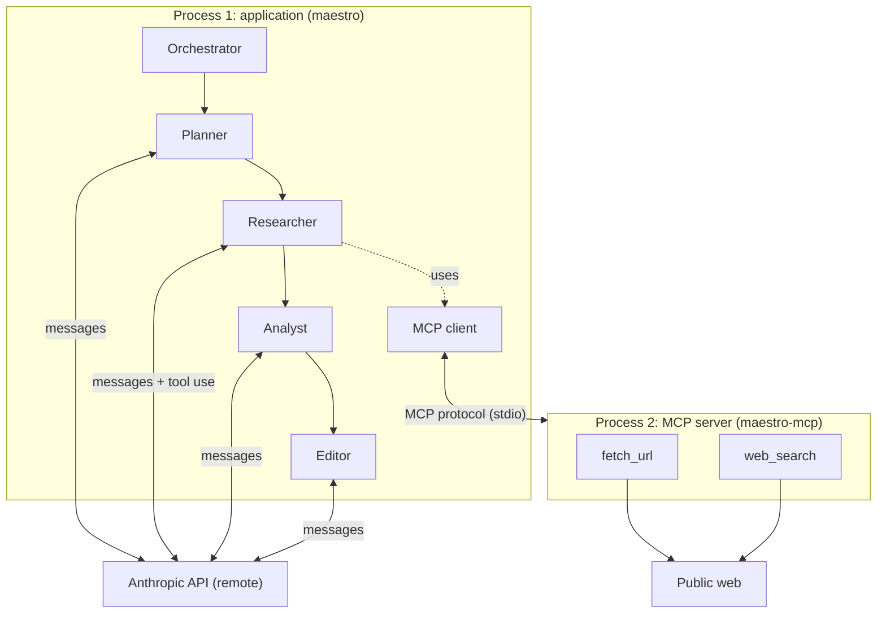
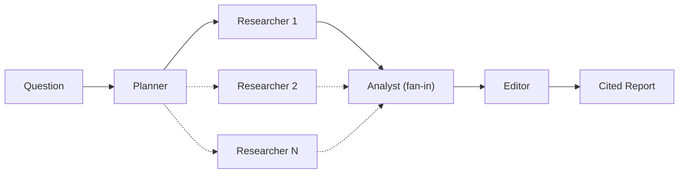

# Design

Maestro is a multi-agent orchestration system that coordinates specialized agents
over the Model Context Protocol (MCP), backed by the Anthropic API. It takes a
research question, gathers live web evidence through MCP tools, and produces a
cited report.

## Process model

v1 runs two local processes plus one remote service:

1. **Application process** — the orchestrator and agents. It acts as the MCP
   *client* and calls the Anthropic API.
2. **MCP server process** — `maestro-mcp`, exposing web-research tools
   (`fetch_url`, `web_search`). It runs as a separate process.
3. **Anthropic API** — a remote service, not a process managed by this project.

Agents (Planner, Researcher, Analyst, Editor) are roles within the single
application process, not separate processes. Process count scales with the
number of MCP servers, not the number of agents.



## MCP concepts

- **Server** — exposes tools (and optionally resources or prompts). It is launched
  as its own process and is client-agnostic.
- **Client** — connects to a server, lists its tools, and invokes them on behalf
  of agents.
- **Tools** — named, schema-described functions the model can call (e.g.
  `fetch_url`, `web_search`).
- **Transport** — how client and server exchange JSON-RPC messages.

### Transport: stdio (v1)

The client launches the server as a subprocess and communicates over
stdin/stdout. Lifecycle is tied to the client; the relationship is 1:1; no
ports or authentication.

MCP client code is isolated behind a thin wrapper so the transport can be
swapped without changing agent or orchestrator code.

## Agent roles

Four specialized roles form a sequential pipeline. Each role has a distinct
responsibility so prompts, tests, and failure modes stay narrow.

| Role | Responsibility | Tools |
| ---- | -------------- | ----- |
| **Planner** | Turn the user question into a structured research plan: subtopics, candidate URLs, and questions to answer. | None (LLM only) |
| **Researcher** | Execute the plan: call MCP tools to fetch pages and search the web; collect raw sources with metadata. | MCP `fetch_url`, `web_search` |
| **Analyst** | Synthesize sources into findings: claims, evidence, and citation keys. Output is structured analysis, not final prose. | None (LLM only) |
| **Editor** | Turn analysis into the final `Report`: readable markdown with inline citations and a bibliography. | None (LLM only) |

### Why Editor is separate from Analyst

The Analyst optimizes for *correctness and traceability*: mapping claims to
sources, resolving conflicts, and flagging gaps. The Editor optimizes for
*readability and citation format*: tone, structure, and consistent reference
style. Merging them would couple two different quality bars and make it harder
to test synthesis independently of presentation. The Analyst output is also
useful as an intermediate artifact (e.g. for debugging or alternate renderings)
without re-running research.

### Planner in v1

The Planner role exists in the architecture from the start, but v1 treats it as a
no-op or single-subtopic pass-through: one plan item, one Researcher run. The
interface and module boundary are stable so parallel subtopics can be added
without reshaping downstream agents.

## Orchestration: fan-out / fan-in

The orchestrator decomposes the question, dispatches research workers, then
synthesizes and formats the result.



In v1 the Planner emits a single subtopic and one Researcher runs; the diagram
structure is unchanged when fanning out to N researchers.

## Components and repository structure

Package layout uses the `src/maestro/` convention (installed via `uv`). The MCP
server must not import orchestration code; dependency direction is one-way
(application → server, via the protocol).

```
agent-orchestration-mcp/
├── pyproject.toml
├── DESIGN.md
├── src/maestro/
│   ├── __main__.py              # `python -m maestro`
│   ├── cli.py                   # CLI entry point
│   ├── orchestrator.py          # wires the agent pipeline
│   ├── models.py                # Report and shared types
│   ├── mcp_client.py            # MCP session + tool calls
│   ├── agents/                  # one module per role
│   │   ├── planner.py
│   │   ├── researcher.py
│   │   ├── analyst.py
│   │   └── editor.py
│   └── mcp_server/              # standalone MCP tool server
│       ├── server.py            # FastMCP entry (`maestro-mcp`)
│       ├── fetch_url.py
│       └── web_search.py
└── tests/
```

| Component | Path | Role |
| --------- | ---- | ---- |
| CLI | `src/maestro/cli.py` | Parses a question, runs the orchestrator, prints the report |
| Orchestrator | `src/maestro/orchestrator.py` | Coordinates the agent pipeline |
| Models | `src/maestro/models.py` | Shared types (`Report`, etc.) |
| MCP server | `src/maestro/mcp_server/` | Standalone tool server (`maestro-mcp`) |
| MCP client | `src/maestro/mcp_client.py` | Spawns the server, invokes tools over stdio |
| Agents | `src/maestro/agents/` | One module per pipeline role |

## Tooling

Dependencies are managed with [uv](https://docs.astral.sh/uv/) (`pyproject.toml`,
`uv.lock`).

| Dependency | Role |
| ---------- | ---- |
| **mcp** | Official MCP SDK (FastMCP server; client session) |
| **httpx** | HTTP client for `fetch_url` |
| **Anthropic SDK** | LLM calls and tool-use loop |

Search and richer page-extraction libraries are introduced when the
corresponding tools are built.

## Architecture tradeoffs

For each decision below, the chosen option reflects v1 priorities: a small,
testable surface area, clear process boundaries, and a pipeline that can grow
to parallel research without restructuring.

### MCP transport: stdio vs Streamable HTTP

| | stdio | Streamable HTTP |
| --- | --- | --- |
| **Lifecycle** | Client spawns server as subprocess | Server runs independently on a URL |
| **Coupling** | 1:1 client–server | Many clients can share one server |
| **Ops** | No ports, no auth on the tool server | Requires network surface, auth, deployment |
| **Fit** | Local dev, single application driving tools | Remote or shared tool servers |

**Chosen: stdio.** v1 has one application process driving one tool server.
Subprocess lifecycle is automatic, there is no extra network attack surface, and
the MCP client wrapper can swap transports later without touching agents.

### MCP server: separate process vs in-process library

| | Separate process | In-process import |
| --- | --- | --- |
| **Boundary** | Protocol-enforced; server is client-agnostic | Shared memory; tighter coupling |
| **Testing** | Server and tools testable without the LLM | Simpler call path, fewer moving parts |
| **Reuse** | Any MCP client can use the tools | Only this application can use the tools |

**Chosen: separate process.** MCP’s value is a standard tool boundary. A
standalone server matches how MCP clients (including this app) integrate in
production and keeps HTTP/search logic out of the agent process.

### Agent count: four roles vs three

| | Four roles (Planner, Researcher, Analyst, Editor) | Three roles (merge Planner and/or Editor) |
| --- | --- | --- |
| **Planner separate** | Stable interface for fan-out to N subtopics | Orchestrator owns decomposition; fewer modules |
| **Editor separate** | Synthesis and presentation tested independently | Analyst produces final prose; fewer LLM calls |
| **Complexity** | More modules and prompts | Fewer boundaries |

**Chosen: four roles.** Planner and Editor are thin in v1 but their boundaries
match the fan-out/fan-in shape the orchestrator will grow into. Separating
Analyst (evidence) from Editor (prose and citations) keeps two different
quality bars from colliding in one prompt.

### Orchestration: hand-rolled loop vs framework (e.g. LangGraph)

| | Hand-rolled async pipeline | Graph framework |
| --- | --- | --- |
| **Visibility** | Linear code; easy to read in a portfolio repo | Declarative graph; more abstraction |
| **Flexibility** | Full control over state passing | Branching, checkpoints, human-in-the-loop |
| **Cost** | More boilerplate for complex flows | Learning curve and dependency |

**Chosen: hand-rolled loop for v1.** The v1 pipeline is sequential with a
fixed shape. A graph framework pays off when branching, retries, or parallel
fan-out become central; the design leaves room to adopt one later without
changing agent interfaces.

### Research fan-out: sequential vs parallel (v1)

| | One Researcher (v1) | N parallel Researchers |
| --- | --- | --- |
| **Concurrency** | Simple; one MCP session | Requires session-per-worker or shared server |
| **Validation** | End-to-end path with fewer failure modes | Higher throughput for broad questions |
| **State** | Linear handoff between agents | Fan-in merge at Analyst |

**Chosen: sequential in v1.** Parallel fan-out is a first-class part of the
architecture (see orchestration diagram) but deferred until the MCP client,
agents, and Analyst fan-in are proven with a single worker.

### Web search provider: Tavily vs DuckDuckGo (and similar)

| | Tavily (or similar API) | DuckDuckGo / no-key fallback |
| --- | --- | --- |
| **Results** | Structured snippets suited to tool use | Less structure; more parsing burden |
| **Setup** | API key required | No key; good for local dev |
| **Reliability** | Paid SLA | Best-effort scraping |

**Open for v1 implementation.** The MCP `web_search` tool will pick one
primary backend with a documented fallback strategy. Tavily favors result
quality; a no-key option favors zero-config development.

## v1 scope and future options

**v1 delivers:** a sequential pipeline (Planner pass-through → one Researcher →
Analyst → Editor), stdio MCP transport, `fetch_url` and `web_search` tools,
hand-rolled Anthropic tool-use loop, and a cited `Report` on the CLI.

**Future options worth revisiting** (not commitments):

- **Streamable HTTP** for MCP when remote or shared tool servers are needed.
- **Parallel Researchers** via `asyncio` fan-out from the Planner, with
  independent MCP client sessions per worker.
- **LangGraph (or similar)** if branching, checkpoints, or human-in-the-loop
  review become requirements.
- **Richer page extraction** (e.g. trafilatura) if regex-based HTML stripping
  proves insufficient for target sites.
- **Planner depth** — promote from pass-through to full LLM decomposition when
  fan-out is enabled.

## Operational constraints

- Secrets in `.env`, never committed.
- A `max_turns` bound on the tool-use loop to cap cost and prevent runaway runs.
- The MCP server is runnable and testable independently of the LLM.
- Tool descriptions are part of the prompt surface; keep them precise.
- Tool failures surface useful messages to the model rather than aborting the run.
